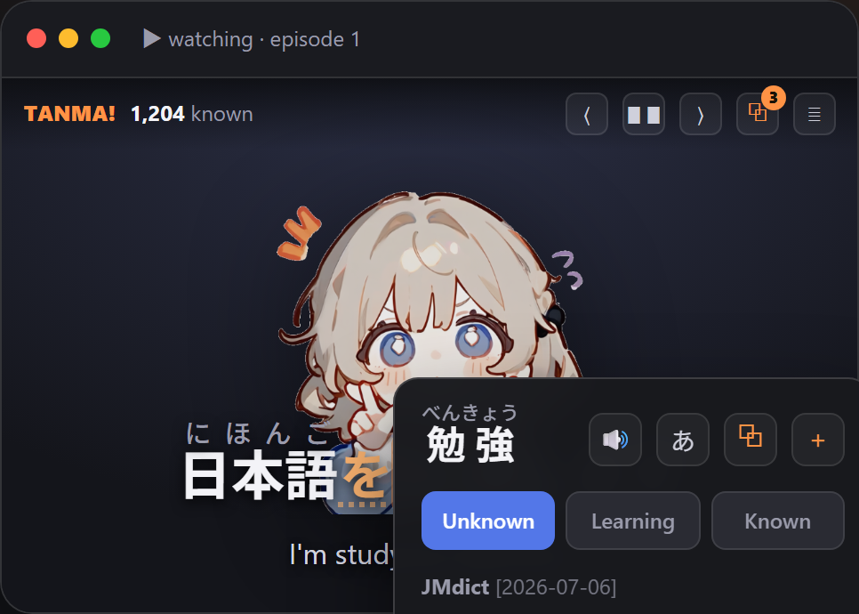
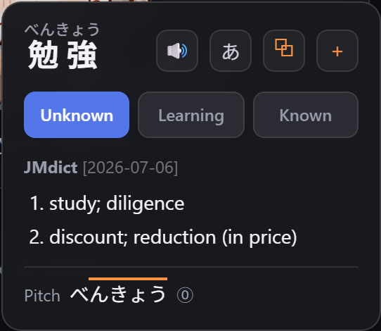
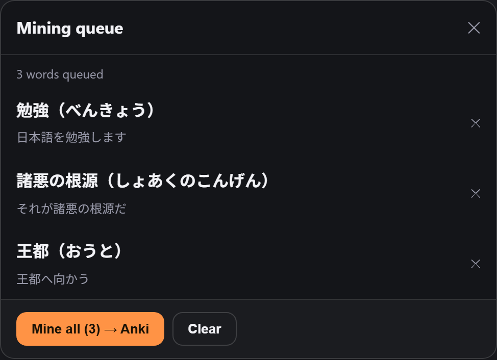
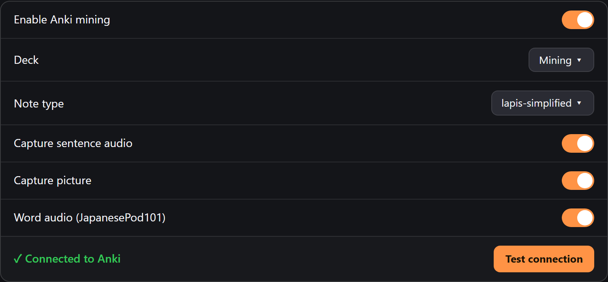

<div align="center">


# TANMA!

### Learn a language from the video you're already watching.

An in-page **learning-subtitle** browser extension: a smart subtitle overlay on any video,
**click-to-look-up** words (Japanese-first, with **furigana**), known/learning tracking, and
**one-click sentence mining to Anki**.

[](#license)


**[⬇ Download](https://github.com/Filleee/tanma/releases)** ·
**[📖 Setup guide](web_doc/tutorial.html)** ·
**[✨ Docs site](web_doc/index.html)** ·
**[Features](#features)**

<br/>



</div>

---

TANMA! is a self-contained **Manifest V3** extension. Whenever there's a `<video>`, it overlays
its own learning subtitles, a subtitle browser, a controls toolbar, **click/hover-to-look-up
words**, and **sentence mining to Anki**. It's **Japanese-first**: real morphological tokenization
with **furigana**, dictionary-form word lookups, and mining into the **lapis-simplified** Anki note
type via **AnkiConnect** — cards go to *your own* local Anki (no cloud account or sync).

<table>
<tr>
<td width="50%" valign="top">

**Look up any word**



</td>
<td width="50%" valign="top">

**Queue &amp; batch-mine to Anki**



</td>
</tr>
</table>

---

## Features

### 📺 Read
- **Overlay on any video** — target line + optional translation, draggable, follows fullscreen and wide/"theater" players.
- **Furigana over kanji** — conjugations collapse to the dictionary form (食べさせられた → 食べる).
- **Color-coded words** — Unknown / Learning / Known; mined words get a dot.
- **Also Chinese & Korean** (Japanese is the focus).

### 🔍 Look up
- **Click a word** → definition. Click again to close.
- **Hold `Alt` + hover** → grab a word mid-sentence (or drag-select an exact span).
- **Rich card** — furigana, reading, pitch, frequency, kanji, 🔊 audio.
- **Your dictionaries** — one-click catalog (Jitendex, JMnedict, KANJIDIC, frequency) or import any Yomitan `.zip`. Offline + instant.

### 🎴 Mine to Anki
- **＋ mine now** — one click → a lapis-simplified card: sentence, definition, screenshot, sentence + word audio (MP3, iOS-ready).
- **⧉ queue + batch later** — tag words while watching, then **Mine all → Anki** (muted, hands-off). Queue survives reload.
- **Mined markers** — ✓ on done lines/words; backfill from an existing deck.
- Needs **Anki + AnkiConnect + lapis-simplified** (see [Install](#install)).

### 📥 Get subtitles
- **YouTube** — automatic.
- **Jimaku** — auto-loads anime subs (free API key); detects show + episode.
- **Song lyrics** — LRCLIB synced lyrics.
- **Import** — your own `.srt` / `.vtt` / `.ass`.
- **Local player** — drop a video + subtitle (or an `.mkv` with embedded subs); Netflix-style controls.

### 🎛️ Control & tune
- **Subtitle browser** — every line: click to seek, search, ⭐ bookmark, ✓ mined.
- **Timing offset** — per-video nudge, or one-click sync to the current line.
- **Pause modes** — per line, or only when you look a word up.
- **Dashboard** — stats, accent colour, per-site rules, backup/restore.
- **Update alerts** — toolbar badge + popup button when a new release ships.

<div align="center"></div>

---

## Install

**Fastest — download a build:**

1. Grab the latest **`dist.zip`** from the [**Releases**](https://github.com/Filleee/tanma/releases) page and unzip it.
2. Go to `chrome://extensions`, enable **Developer mode** (top-right).
3. Click **Load unpacked** and select the unzipped **`dist`** folder.

**Or build from source:**

```bash
cd project
npm install
npm run build      # outputs the unpacked extension into project/dist
```

Then load `project/dist` unpacked as above. `npm run dev` rebuilds on change (hit the ⟳ reload
button on the extension card). A local release zip can be produced with
`node scripts/release.mjs v0.2.0`.

**To mine to Anki:** open Anki with the **AnkiConnect** add-on, install the **lapis-simplified**
note type, and in **Options → Anki** add this extension's origin to AnkiConnect's
`webCorsOriginList` (the **Test connection** button prints the exact value). The full walkthrough is
in the **[setup guide](web_doc/tutorial.html)**.

### Try it

- **YouTube:** open any video that has captions — subtitles load automatically.
- **Local test:** `npx serve project/test`, open the printed URL, click the toolbar's **⬆ import**,
  choose `project/test/sample.ja.srt`, and press play.

---

## Architecture

A small, dependency-light TypeScript app built around a Shadow-DOM overlay with its own class
names (`TnmSubs`, `tnm-token`, `TnmBrowser`, `TnmBar`, `data-tnm-known-status`, …):

| Area | How it's done |
| --- | --- |
| Content-script injection | tiny `content-loader.js` dynamic-imports the ESM bundle |
| Overlay isolation | Shadow DOM host, reparented into the fullscreen element |
| Japanese tokenizer | `kuromoji` (IPADIC) + conjugation-merge; dict shipped as web-accessible resources |
| CJK fallback | `Intl.Segmenter` |
| Dictionaries | imported Yomitan `.zip` → IndexedDB (offline); Jisho / Wiktionary online |
| Card creation | AnkiConnect → lapis-simplified (text + screenshot/clip + MP3 audio) |
| Storage | `chrome.storage.local` — per-site & global settings, per-video offset + track + queue, known words, mined set, bookmarks |

### Source layout

```
src/
  manifest.ts            generated → dist/manifest.json
  common/types.ts        shared domain types + default settings
  lib/
    parsers/             srt / vtt / ass / youtube(json3,srv3) / lrc + secondary-line align
    tokenizer/           japanese (kuromoji) + jaMerge (conjugation merge) + Intl.Segmenter
    kana.ts              katakana→hiragana + okurigana-aware furigana splitting
    storage.ts           settings (per-site/global), per-video offset + track + queue, known-words, mined store
    yomitan/             imported-dictionary engine: parse banks + IndexedDB + lookup
    anki/                AnkiConnect client + lapis-simplified field mapping
    version.ts           semver compare for the update check
  pages/options/         dictionaries, Anki mining, look-up & keybindings, Jimaku key
  content/
    main.ts              entry (frame guard)
    app.ts               controller: sync loop, look-up, pause, mining, queue, YouTube, import, Jimaku
    videoManager.ts      finds/tracks the primary <video>
    mp3.ts               webm/opus → MP3 transcode (lamejs) for iOS-playable card audio
    ui/                  ShadowHost, TnmSubs, TnmBar, SettingsPanel, TnmBrowser,
                         JimakuPanel, LyricsPanel, QueuePanel, LookupPopup, token renderer, css
  inject/youtube.ts      MAIN-world: reads/translates YouTube caption tracks → postMessage
  background/main.ts     dictionary lookups + word audio + AnkiConnect proxy/mine + Jimaku/LRCLIB proxy + update check
  popup/                 toolbar popup (per-site enable + language + help + update banner)
web_doc/                 the documentation / marketing site (static HTML/CSS/JS)
```

---

## Limitations / notes

- **YouTube auto-enables its own captions.** YouTube returns HTTP 403 for direct caption downloads
  (a player-generated token is required), so the extension turns on YouTube's captions for your
  target language, piggy-backs on that request, then hides the native rendering. You may briefly see
  YouTube's captions before the overlay takes over.
- **Netflix / Crunchyroll / Disney+ etc. are not hooked** (DRM-obfuscated streams, out of scope).
  Use YouTube, Jimaku, or import a file.
- **Sentence/word look-up vs Yomitan**: kuromoji segments morphemes (with a conjugation merge), not
  Yomitan's rule-based deinflection + longest dictionary match. They agree for most words; the
  hold-key sub-piece scan grabs by morpheme boundary (no dictionary deinflection yet).
- **Mined-clip on mobile**: the still-image Picture + MP3 audio play on iOS; the *optional animated
  clip* is webm (desktop-only).
- Online lookups need network. Japanese uses **Jisho** (JMdict); others use **Wiktionary**.
- The first Japanese line triggers a one-time **kuromoji dictionary load** (~a few MB); words are
  clickable without furigana until it finishes, then it re-renders.
- A study tool — no cloud SRS/account/sync; cards go to your own local Anki.

---

## Acknowledgements

TANMA! stands on a lot of wonderful open-source work and community data. Special thanks to:

- **[Yomitan](https://github.com/yomidevs/yomitan)** — the pop-up look-up + deinflection experience that inspired the word look-ups.
- **[Textractor](https://github.com/Artikash/Textractor)** — text hooking for visual novels &amp; games (used by the tanma-hook companion).
- **[kuromoji.js](https://github.com/takuyaa/kuromoji.js)** + **IPADIC** — Japanese morphological tokenization &amp; furigana.
- **[AnkiConnect](https://foosoft.net/projects/anki-connect/)** and the **[lapis-simplified](https://github.com/friedrich-de/lapis-simplified)** note type (from the [animecards.site](https://animecards.site) setup) — the Anki mining pipeline.
- **[Jimaku](https://jimaku.cc)** — Japanese subtitle sourcing; **[LRCLIB](https://lrclib.net)** — time-synced song lyrics.
- **[JMdict / JMnedict / KANJIDIC](https://www.edrdg.org/)** and **[Jitendex](https://jitendex.org)** — the dictionary data.
- **JapanesePod101** &amp; **Google TTS** — word-audio pronunciations.
- **[kotoba-whisper](https://huggingface.co/kotoba-tech)** — Japanese ASR (used by the tanma-asr companion).
- And the wider **immersion-learning community** for the ideas and tooling this builds on. 🙏

---

## License

**GPL-3.0-or-later.** TANMA! is and will stay free software: use it, read it, fork it —
derivatives must remain free under the same terms.
